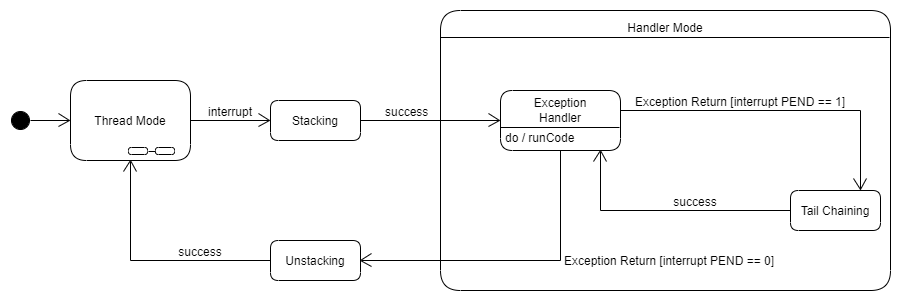
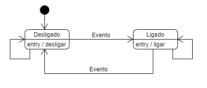
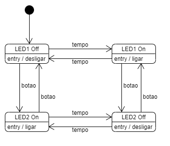

# Lab 03

## Goal

Create a finite state machine to show Gray code sequentially using
3 builtin LEDs on the Texas Kit.

[Instructions (Portuguese)](./lab3.pdf)

## State Machine Diagrams

1. Thread Mode to Handler Mode transition

2. Blinking LED

Refers to [fsm_state](../fsm_state)

3.

Refers to [fsm_matrix](../fsm_matrix)

